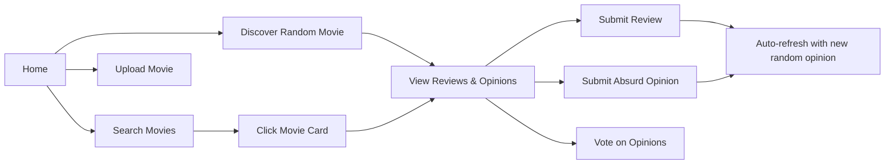

<div align="center">

# 🦄 UnreliableUnicorn

### *Where Movie Reviews Meet Delightful Absurdity*

[](https://www.typescriptlang.org/)
[](https://vuejs.org/)
[](https://vitejs.dev/)

*A modern, interactive web app that combines real movie reviews with hilariously unreliable AI-generated opinions*

[Live Demo](#) • [Report Bug](#) • [Request Feature](#)

</div>

---

## ✨ What Makes This Special?

UnreliableUnicorn isn't just another movie database. It's an experience where cinema meets comedy, where genuine critiques dance with absurd AI hallucinations, and where users contribute to the chaos.

### 🎬 Core Features

- **🎲 Random Discovery** - Surprise yourself with random movies paired with real reviews AND ridiculous AI takes
- **🔍 Smart Search** - Find any movie in our database with lightning-fast search
- **⭐ Top Absurd Opinions** - Browse the most hilariously ranked AI-generated movie opinions
- **✍️ Dual Submission System**:
  - Submit serious, thoughtful reviews
  - Share your own absurd, unreliable opinions
- **👍 Interactive Voting** - React with Up, Down, LOL, or WTF votes
- **🎨 Upload Movies** - Contribute to the database with new movie entries
- **📱 Fully Responsive** - Gorgeous on desktop, tablet, and mobile

---

## 🚀 Quick Start

### Prerequisites

- Node.js 16+ and npm
- A sense of humor
- Love for movies (optional but recommended)

### Installation

```bash
# Clone the repository
git clone https://github.com/yourusername/unreliableunicorn-front.git
cd unreliableunicorn-front

# Install dependencies
npm install

# Create environment file
cp .env.example .env

# Add your API key to .env
# VITE_API_KEY=your-api-key-here

# Start the dev server
npm run dev
```

Visit `http://localhost:5173` and let the absurdity begin! 🎉

---

## 🎨 Features Showcase

### Random Movie Discovery
```
┌─────────────────────────────────────────┐
│  🎬 The Matrix (1999)                   │
│  ─────────────────────────────────────  │
│  ✓ Real Review                          │
│  A groundbreaking sci-fi masterpiece... │
│                                         │
│  🦄 Unreliable Opinion                  │
│  Actually filmed in a real computer...  │
│  ─────────────────────────────────────  │
│  [Write Review] [Share Absurd Take]     │
└─────────────────────────────────────────┘
```

### Interactive Voting System
Vote on the most absurd opinions:
- 👍 Upvote - It's believable!
- 👎 Downvote - Too ridiculous
- 😂 LOL - Hilarious
- 🤯 WTF - Mind-blowing nonsense

---

## 🛠️ Tech Stack

### Frontend Excellence
- **Vue 3** - Composition API with `<script setup>`
- **TypeScript** - Full type safety
- **Vue Router** - SPA navigation
- **Axios** - HTTP client with interceptors
- **Vite** - Lightning-fast HMR

### Code Quality
- Fully typed interfaces
- Environment variable management
- Responsive CSS with custom properties
- Component-based architecture

---

## 📁 Project Structure

```
unreliableunicorn-front/
├── src/
│   ├── components/
│   │   ├── MovieCard.vue           # Main movie display
│   │   ├── OpinionCard.vue         # Opinion with voting
│   │   ├── ReviewForm.vue          # Submit reviews
│   │   └── AbsurdOpinionForm.vue   # Submit absurd takes
│   ├── views/
│   │   ├── HomeView.vue            # Landing page
│   │   ├── DiscoverView.vue        # Random movie discovery
│   │   ├── SearchView.vue          # Movie search
│   │   ├── TopOpinionsView.vue     # Top absurd opinions
│   │   ├── UploadMovieView.vue     # Upload new movies
│   │   └── MovieDetailView.vue     # Individual movie page
│   ├── services/
│   │   └── api.ts                  # API client with all endpoints
│   ├── types/
│   │   └── api.ts                  # TypeScript interfaces
│   ├── router/
│   │   └── index.ts                # Route configuration
│   ├── App.vue                     # Root component
│   └── main.ts                     # App entry point
├── .env                            # Environment variables (not in git)
├── .env.example                    # Environment template
└── package.json
```

---

## 🔐 Environment Variables

Create a `.env` file in the root:

```env
VITE_API_BASE_URL=https://unreliableunicorn-api.onrender.com
VITE_API_KEY=your-api-key-here
```

> **⚠️ Security Note:** Never commit `.env` to version control!

---

## 🎯 Available Scripts

```bash
# Development
npm run dev          # Start dev server with HMR

# Production
npm run build        # Build for production
npm run preview      # Preview production build

# Type Checking
vue-tsc              # Check TypeScript types
```

---

## 🌈 Design Philosophy

### Color Palette
- **Primary**: `#9333ea` - Purple magic
- **Secondary**: `#ec4899` - Pink energy
- **Accent**: `#f59e0b` - Golden highlights
- **Background**: Dark gradients for that cinema feel

### UX Principles
1. **Fun First** - Every interaction should spark joy
2. **Responsive Always** - Beautiful on every device
3. **Fast & Smooth** - Animations that enhance, never hinder
4. **Clear Feedback** - Users always know what's happening

---

## 🎮 User Journey



---

## 📊 API Integration

### Endpoints Used

| Endpoint | Method | Purpose |
|----------|--------|---------|
| `/pelicula/random` | GET | Random movie with reviews |
| `/pelicula/search` | GET | Search movies by title |
| `/pelicula/{id}` | GET | Get specific movie |
| `/pelicula/` | POST | Upload new movie |
| `/pelicula/{id}/review` | POST | Submit review |
| `/pelicula/{id}/opinion` | POST | Submit absurd opinion |
| `/opiniones/top` | GET | Top-ranked opinions |
| `/vote/opinion/{id}` | POST | Vote on AI opinion |
| `/vote/user-opinion/{id}` | POST | Vote on user opinion |

All requests include API key authentication via `X-API-Key` header.

---

## 🎨 Component Highlights

### MovieCard
The crown jewel - displays:
- Movie poster & backdrop
- Metadata (year, runtime, rating, genres)
- Overview/description
- Side-by-side real review vs. unreliable opinion
- Review submission form
- Absurd opinion submission form

### OpinionCard
Interactive opinion display with:
- Rank badges (🥇🥈🥉)
- Absurdity score
- Four-way voting system
- Real-time vote counts
- Smooth animations

---

## 🚦 Deployment

### Build for Production

```bash
npm run build
```

Outputs to `dist/` directory.

### Deploy to Vercel

```bash
vercel deploy
```

Don't forget to set environment variables in your hosting platform!

### Deploy to Netlify

```bash
netlify deploy --prod
```

---

## 🤝 Contributing

We welcome contributions! Whether you want to:
- 🐛 Fix bugs
- ✨ Add features
- 📝 Improve documentation
- 🎨 Enhance UI/UX

Please feel free to open issues and pull requests!

---

## 📝 License

This project is open source and available under the [MIT License](LICENSE).

---

## 🙏 Acknowledgments

- Movie data powered by [UnreliableUnicorn API](https://unreliableunicorn-api.onrender.com)
- Built with love, Vue 3, and way too much coffee ☕
- Inspired by the perfect combination of cinema and chaos

---

## 📬 Contact

Questions? Suggestions? Want to share your favorite absurd opinion?

- Create an issue on GitHub
- Or just enjoy the absurdity! 🦄

---

<div align="center">

### Made with ❤️ and lots of 🦄

*Where every movie opinion is delightfully unreliable*

**⭐ Star this repo if you enjoyed the absurdity! ⭐**

</div>
